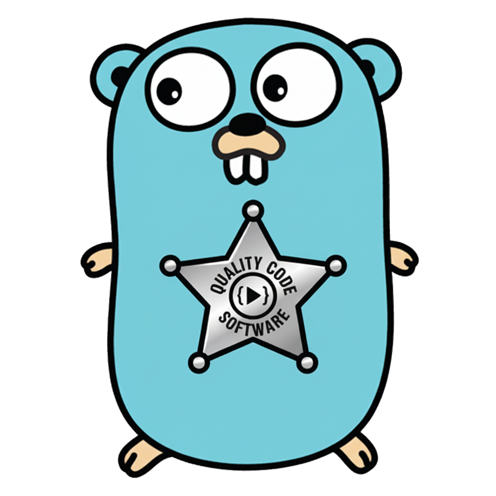

  
  
  <h1>Go Quality Gate</h1>
  
  

    
    
    
    
    
    
  

  
  
<strong>Language-agnostic code quality control tool with Git hooks</strong>

A code quality control tool built in Go, distributed as a single binary with no external runtime dependencies. Provides enhanced visual feedback with spinners, execution timing, and structured JSON output.

## ✨ Key Features

- **🏗️ Single Binary**: Zero runtime dependencies (Python, Node.js)
- **🔧 Automatic Setup**: Installs quality tools automatically
- **🌍 Multi-language**: Supports multiple languages in the same repository
- **📊 Observability**: Spinners, timing, and real-time visual feedback
- **🔒 Built-in Security**: Secret scanning in commit workflow
- **⚡ Native Performance**: Instant execution without interpreters
- **🚀 CI/CD Ready**: Clean JSON output for automation pipelines

## 🚀 Quick Start

Get started with Go Quality Gate in just a few steps:

1. **[Installation](installation.html)** - Download and install the binary
2. **[Usage](usage.html)** - Learn how to use the tool
3. **[Configuration](configuration.html)** - Customize for your project

## 📖 Documentation

- [Installation Guide](installation.html)
- [Usage Examples](usage.html)
- [Configuration Reference](configuration.html)
- [Contributing](contributing.html)

## 🛠️ Supported Tools

Go Quality Gate automatically detects and configures quality tools based on your project:

### Go Projects

- **gofmt** - Code formatting
- **goimports** - Import management
- **golangci-lint** - Comprehensive linting
- **go vet** - Static analysis
- **gosec** - Security scanning

### Python Projects

- **black** - Code formatting
- **isort** - Import sorting
- **flake8** - Linting and style checking
- **mypy** - Type checking
- **bandit** - Security scanning

### Node.js Projects

- **prettier** - Code formatting
- **eslint** - Linting and code analysis
- **npm audit** - Security scanning

### Universal Tools

- **gitleaks** - Secret scanning
- **shellcheck** - Shell script analysis (when applicable)

## 🔧 Project Status

This project is actively maintained and used in production environments. We welcome contributions and feedback from the community.

## 📄 License

This project is licensed under the MIT License - see the [LICENSE](https://github.com/dmux/go-quality-gate/blob/main/LICENSE) file for details.
